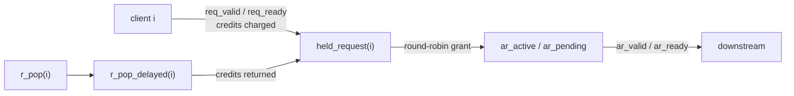

# axi_ar_mux - Architecture and Operation

This document describes the internal structure of `axi_ar_mux` and how it
works, in enough detail to modify it safely. It is the companion to two other
documents:

| Document | Purpose |
|---|---|
| `README.md` | Integration guide: generics, ports, when to use it, results. |
| `AR_MUX_REVIEW.md` | Diagnostic guide for a silent AR channel (written for revision 1.01; the debug checklist still applies). |
| `AR_MUX_ARCHITECTURE.md` | This document: internal structure and operation. |

All source references are to `rtl/axi_ar_mux.vhd` unless stated otherwise.

--------------------------------------------------------------------------

## 1. What the IP does

`axi_ar_mux` merges `GC_NUM_CLIENTS` independent AXI4 read-address (AR)
request interfaces into one shared AR channel.

It exists to pair with `axi_r_demux`: this IP issues read commands, the
downstream memory returns data, and `axi_r_demux` routes each response back to
the requesting client. Because the shared channel can only carry one
transaction at a time, two problems must be solved:

1. **Fairness.** Every client must eventually get access. Solved by
   round-robin arbitration.
2. **Flow control.** The downstream response storage (per-client FIFOs in the
   demux) must never overflow. Solved by per-client *beat credits*: a client
   may only issue a read while it has enough credits to cover every beat it
   will receive, and credits are returned as responses are popped.

The credit system is what ties the AR side to the R side. Revision 2.00
charges credit when a request is accepted, which keeps the credit logic
separate from arbitration.

--------------------------------------------------------------------------

## 2. File map

| File | Role |
|---|---|
| `rtl/axi_ar_mux.vhd` | The core. One entity, one record-based state machine. |
| `top/axi_ar_mux_top.vhd` | VHDL wrapper adding data-width and ARLEN conversion. |
| `top/axi_ar_mux_top.sv`, `top/axi_ar_mux_inst.sv`, `top/axi_ar_mux_inst.vhd` | Alternative wrappers / instantiation templates. |
| `tb/axi_ar_mux_tb.vhd` | Self-checking testbench, generic-parameterised. |
| `scripts/vhdl.f` | Manifest: file list plus the twelve testbench modes. |
| `scripts/axi_ar_mux_implementation.tcl`, `scripts/axi_ar_mux_timing.xdc` | Standalone 200 MHz place-and-route timing check. |
| `AR_MUX_ARCHITECTURE.md`, `AR_MUX_REVIEW.md`, `README.md` | Documentation. |

The core is deliberately independent of data width, ARLEN width, ID width and
address width; everything width-dependent is confined to the wrapper.

--------------------------------------------------------------------------

## 3. Interface

### 3.1 Core entity

Generics:

| Generic | Default | Meaning |
|---|---|---|
| `GC_NUM_CLIENTS` | 4 | Number of request interfaces. |
| `GC_ADDR_WIDTH` | 32 | Address width. |
| `GC_ID_WIDTH` | 4 | AR ID width. Elaboration-checked against `GC_NUM_CLIENTS`. |
| `GC_FIFO_DEPTH` | 32 | Per-client credit limit, in client beats. |
| `GC_R_BEATS_PER_POP` | 1 | Client beats returned by one `r_pop` pulse. |

Ports: `aclk`, `aresetn`, the per-client `req_addr` / `req_len` / `req_valid`
/ `req_ready` arrays, the per-client `r_pop` array, and the shared AR payload
`ar_id` / `ar_addr` / `ar_len` / `ar_valid` / `ar_ready`.

`req_len` is **ARLEN**, i.e. beats minus one, in the *client* beat unit. The
core never sees a data width; it works purely in beats.

### 3.2 Wrapper (`axi_ar_mux_top`)

The wrapper exists because a client may work in wider beats than the memory
port. It adds:

| Generic | Default | Meaning |
|---|---|---|
| `GC_CLIENT_DATA_WIDTH` | 512 | Client beat width in bits. |
| `GC_NATIVE_DATA_WIDTH` | 128 | Memory-side beat width in bits. |
| `GC_CLIENT_ARLEN_WIDTH` | 6 | Width of the client's ARLEN field. |
| `GC_NATIVE_ARLEN_WIDTH` | 8 | Width of the shared ARLEN field. |
| `GC_BURST_TYPE` | `"01"` | Value driven on `ar_burst` (INCR). |

Two conversions happen here, and only here:

1. **ARLEN is scaled by the width ratio.**
   ```text
   C_RATIO      = GC_CLIENT_DATA_WIDTH / GC_NATIVE_DATA_WIDTH
   native_beats = (client_arlen + 1) * C_RATIO
   ar_len       = native_beats - 1
   ```
   A client asking for one 512-bit beat on a 128-bit port becomes a 4-beat
   native burst.

2. **ARLEN is zero-extended the other way** into the core's 8-bit
   `req_len`, so the core sees a uniform field.

`ar_size` is derived from `GC_NATIVE_DATA_WIDTH`, `ar_burst` is the constant
`GC_BURST_TYPE`, and a block of assertions checks that the two widths are
byte multiples, powers of two, ratio-integral, and that the native ARLEN is
wide enough to express the scaled burst.

**Consequence for credits.** Credits are counted in *client* beats, because
that is the unit the core arbitrates in. The R side returns native beats, so
`GC_R_BEATS_PER_POP` must be set to the R-side conversion ratio; otherwise
credits are returned at the wrong rate and the client either starves or is
allowed to over-issue.

--------------------------------------------------------------------------

## 4. State

All persistent state lives in one record, `rec_t`, committed by one
register process:

```vhdl
type held_request_t is record    -- accepted, credits already charged
  addr  : std_logic_vector(GC_ADDR_WIDTH-1 downto 0);
  len   : std_logic_vector(7 downto 0);
  valid : std_logic;
end record;

type ar_slot_t is record         -- one AR transaction
  id    : std_logic_vector(GC_ID_WIDTH-1 downto 0);
  addr  : std_logic_vector(GC_ADDR_WIDTH-1 downto 0);
  len   : std_logic_vector(7 downto 0);
  valid : std_logic;
end record;

type rec_t is record
  credits       : credits_array_t;       -- per client, 0 .. GC_FIFO_DEPTH
  r_pop_delayed : std_logic_vector;      -- r_pop, registered on input
  held_request  : held_request_array_t;  -- one per client
  last_granted  : client_t;              -- round-robin position
  ar_active     : ar_slot_t;             -- drives the AR port
  ar_pending    : ar_slot_t;             -- only valid while ar_active is valid
end record;
```

Reset value (`C_REC_DEFAULT`): all slots empty, every client at full credit
`GC_FIFO_DEPTH`, and `last_granted = GC_NUM_CLIENTS-1` so client 0 is
served first.

Two invariants hold at all times:

- **A held request is always paid for.** Its beats were subtracted from
  `credits` on the edge it was accepted.
- **`ar_pending` is only valid while `ar_active` is valid.** A grant goes to
  `ar_active` whenever that slot is free after retirement, so the pending
  slot is only used behind a stalled active transaction.

--------------------------------------------------------------------------

## 5. Structure of `p_comb`

The RTL follows the repository's record-based two-process style
(`fpga-rules/hdl_coding_rules.md`): `p_comb` computes the next state `v`
from `r`, and `p_reg` commits it. The rules forbid a second combinational
process - a delta race of exactly that kind once lost a credit debit in this
IP - so the design is divided into **ordered sections inside `p_comb`**,
not into separate processes or entities.

| Order | Section | Writes | Reads |
|---|---|---|---|
| 1 | AR side | `ar_active`, `ar_pending` | `ar_ready` |
| 2 | Arbitration | `last_granted`, the AR slots, `held_request(grant_client).valid` | `held_request`, `ar_pending.valid` |
| 3 | Admission and credits, per client | `held_request(i)`, `credits(i)`, `r_pop_delayed` | `req_*`, `credits`, `grant_valid`, `grant_client` |

The only information passed forward is `grant_valid` / `grant_client`:
admission must know whether a client's holding register is emptied this
cycle. Nothing flows backwards, and **arbitration never reads credits**.

| Function | Purpose |
|---|---|
| `f_beats` | `ARLEN + 1`. |
| `f_next_in_turn` | Round robin: the first requesting client after `last_granted`, wrapping. |
| `f_to_ar_slot` | Builds an AR transaction from a held request; `id` is the client index. |

The AR port is driven from `r.ar_active`, so it is registered and stable
while waiting for `ar_ready`. `req_ready` is the one combinational output;
it is forced low during reset.

--------------------------------------------------------------------------

## 6. The pipeline



```text
Edge N     req_valid & req_ready handshake; request enters held_request(i),
           its beats are charged to credits(i)
Edge N+1   held request is granted into ar_active; ar_valid rises
Edge N+2   ar_valid & ar_ready handshake; transaction leaves
```

The minimum request-to-AR latency is two clocks, and `ar_valid` is *not*
asserted on the same edge as the client handshake. This is the most common
source of "it produces nothing" confusion; see `AR_MUX_REVIEW.md`.

**Line rate.** A holding register counts as free on the cycle its request is
granted, so a client can hand over its next request on that same edge. With
`ar_ready` high the AR channel therefore carries one transaction per clock,
from a single client or shared round-robin between several.

--------------------------------------------------------------------------

## 7. Credit system

### 7.1 Lifecycle of a credit

```text
reset       credits(i) = GC_FIFO_DEPTH
            |
            |  req handshake; credits(i) covers the request's beats
            v
charged     credits(i) := credits(i) - beats; request enters held_request(i)
            |
            |  r_pop(i) is high at edge E
            v
delayed     r_pop_delayed(i) = '1' after edge E
            |
            |  edge E+1
            v
returned    credits(i) := min(credits(i) + GC_R_BEATS_PER_POP, GC_FIFO_DEPTH)
```

A request waiting for returned credits is therefore accepted at edge E+2.
Credit is only created by `r_pop`, and it is spent the moment a request is
accepted - so a held request is always paid for, and arbitration never has to
check credit.

### 7.2 The admission decision

Per client, from registered state and the presented request:

```text
credits_left  = credits(i) - beats(req_len(i))       -- negative: does not fit
holding_free  = held_request(i) empty, or granted this cycle
lacks_credit  = req_valid(i) and credits_left < 0
client_ready  = holding_free and not lacks_credit
```

`lacks_credit` only applies while a request is presented, so an idle client
sees `req_ready` high whenever its holding register is free.

### 7.3 Both outcomes computed in advance

The next credit value is computed for both outcomes from registers alone,
and the handshake only selects between them:

```text
accepted       : min(credits_left + returned_beats, GC_FIFO_DEPTH)
not accepted   : min(credits(i)   + returned_beats, GC_FIFO_DEPTH)
```

This is a timing structure. Written serially - compare, then decide, then
subtract - the same logic measured **-0.591 ns** at 5.0 ns; in this form it
measures **+0.436 ns**. `credits_left` also serves as the "does it fit"
test, so no separate comparator is needed.

### 7.4 Saturation

Returns saturate at `GC_FIFO_DEPTH`. Extra or duplicated `r_pop` pulses can
over-count but never push a client above its configured budget. Saturation
is a guard, not a licence: `r_pop` must still match the real R-side packing
ratio.

### 7.5 Oversized requests

A request with `beats > GC_FIFO_DEPTH` can never be accepted, because
credits never exceed `GC_FIFO_DEPTH`. The RTL treats this as a contract
violation and asserts at presentation time (severity `failure`) rather than
letting the client's channel stall silently.

--------------------------------------------------------------------------

## 8. Arbitration

```text
ar_has_room  = ar_pending is empty
grant_valid  = ar_has_room and any held_request is valid
grant_client = f_next_in_turn(held_valid, last_granted)
```

`ar_has_room` deliberately ignores `ar_ready`. The pending slot is the
elasticity, so a grant can be taken whenever it has somewhere to go, and
`req_ready` does not depend combinationally on `ar_ready`.

`f_next_in_turn` returns the first requesting client after `last_granted`,
wrapping:

```vhdl
for distance in GC_NUM_CLIENTS downto 1 loop  -- nearest candidate is assigned last
  candidate := (last_granted + distance) mod GC_NUM_CLIENTS;
  if requesting(candidate) = '1' then
    winner := candidate;
  end if;
end loop;
```

Only held, already-paid-for requests take part, so a client that is out of
credit never appears in arbitration and cannot block the others. After a
grant, `last_granted` moves to the served client, so every other waiting
client is served before it again.

--------------------------------------------------------------------------

## 9. AR slot management and handshakes

```text
ar_accepted : ar_active.valid and ar_ready
  -> ar_active := ar_pending; ar_pending.valid := '0'

grant_valid : place the granted request
  -> into ar_active if it is free after the step above, else ar_pending
```

The first step also covers the case where nothing is pending: copying the
empty `ar_pending` into `ar_active` empties it. Retirement happens before
placement, so a slot freed on this edge is reused by a grant on the same
edge.

| Situation | Result |
|---|---|
| `ar_ready` low, nothing pending | Active transaction held, `ar_valid` high. One further grant moves to `ar_pending`. |
| `ar_ready` low, pending full | No grant. Requests wait in their holding registers; `req_ready` reflects holding space and credit. |
| `ar_ready` high, pending full | Active transfers and pending moves up. The grant resumes on the next edge, when the new active transfers, so `ar_valid` has no bubble. |

A stalled `ar_ready` cannot silence the module: `ar_valid` stays asserted,
and only the AR side backs up.

--------------------------------------------------------------------------

## 10. Timing structure

Measured post-route on `xc7a200tfbg676-1`, Vivado 2023.2, default 4-client
configuration, register-to-register (input and output ports false-pathed):

| Revision | Clock | WNS | Worst path |
|---|---|---|---|
| 2.00 | 5.0 ns (200 MHz) | **+0.436 ns**, met | `credits(i)` -> `credits(i)`, 6 levels, 3.98 ns |
| 1.01 | 7.0 ns (143 MHz) | -1.566 ns, not met | `grant_idx` -> `grant_idx`, 10 levels, 8.52 ns |

Revision 1.01 charged credit at grant time. The next grant then depended on
the credit left after the current grant, so one loop contained the credit
subtraction, the fit comparison and the round-robin scan across all
clients. Charging credit at acceptance removes all credit arithmetic from
the arbitration loop. What remains:

- **Arbitration loop:** holding-register valid bits and `last_granted` ->
  `f_next_in_turn` -> `last_granted` and the AR slots. No arithmetic.
- **Credit loop, per client:** `credits(i)` -> subtract and add -> select
  -> `credits(i)`. This is the current worst path. Section 7.3 explains
  why both outcomes are computed before the handshake selects one.

Two paths depend combinationally on inputs and are false-pathed by the
harness: `req_valid`/`req_len` -> `req_ready`, and `ar_ready` -> the AR
slots. The integrating design must constrain them.

--------------------------------------------------------------------------

## 11. Verification

`scripts/vhdl.f` defines twelve simulation modes. All twelve are expected to
report `ALL AR-MUX CHECKS PASSED` with `Errors: 0`:

| Mode | Configuration | What it exercises |
|---|---|---|
| `default` | 4 clients, depth 32 | The shipped configuration. |
| `depth32` | depth 32 | Explicit depth-32 case. |
| `c1` / `c2` / `c3` | 1 / 2 / 3 clients, depth 4 | Degenerate client counts, matching `GC_ID_WIDTH`. |
| `small` | depth 4 | Small credit budget. |
| `min2` | depth 2 | Minimum legal depth. |
| `nonpow5` | depth 5 | Non-power-of-two credit range. |
| `wide` | 8 clients, depth 8 | Wide client count and 4-bit IDs. |
| `ratio2` / `ratio3` | `GC_R_BEATS_PER_POP` 2 / 3 | Credit return ratio, saturation. |
| `maxlen` | 1 client, depth 256 | Maximum credit width, 8-bit ARLEN. |

The testbench is organised in three layers inside `p_stim`:

1. **Helpers**: `p_start_test` (report the name, idle all inputs, reset),
   `p_present`, `p_send`, `p_withdraw`, `p_pop`, `p_expect_refused`,
   `p_check_ar_is`, `p_wait_ar`, `p_stream_client0`. Burst sizes are given
   in beats; `f_arlen` converts to ARLEN in one place.
2. **Tests**: one procedure per behaviour, each starting from a fresh
   reset so no test depends on the credit left by an earlier one.
3. **Main sequence**: the list of tests, read top to bottom.

Each test reports `AR-MUX TEST: <name>`:

| Test | Checks |
|---|---|
| `test_reset_state` | All `req_ready` high, AR idle. |
| `test_first_request_line_rate` | One accept per clock straight after reset; AR payloads in order. |
| `test_single_transaction` | AR payload; holding register free afterwards. |
| `test_ar_stall` | AR payload stable while `ar_ready` is low; `ar_pending` and a holding register absorb two more requests; in-order drain. |
| `test_credit_limit` | Refused when it does not fit, accepted after `r_pop`, zero credit refuses a one-beat request. |
| `test_pop_during_handshake` | `r_pop` on the AR transfer edge is not lost. |
| `test_refused_does_not_block` | A refused client does not delay another (2+ clients). |
| `test_single_client_stream` | Whole budget at one request per clock, in order. |
| `test_all_clients_line_rate` | One AR per clock, round-robin order, two rounds. |
| `test_exhausted_client` | Zero credit refuses the next request. |
| `test_reset_while_stalled` | Reset with AR stalled; clean recovery. |
| `test_pop_returns_ratio` | One `r_pop` pays for exactly `GC_R_BEATS_PER_POP` beats. |

Each mode ends by reporting `ALL AR-MUX CHECKS PASSED`. All twelve modes
pass on ModelSim 2020.1 and on XSim (Vivado 2023.2). Running both matters
for this IP: its delta-race history showed up on one simulator only.

The checks were confirmed to fail on real bugs: disabling the same-edge
refill fails `test_first_request_line_rate` (`req_ready bubble`), and never
charging credit fails `test_credit_limit` (`full-budget request accepted
without credit`).

Timing is checked by `scripts/axi_ar_mux_implementation.tcl` with
`scripts/axi_ar_mux_timing.xdc`; see the README for the command.

--------------------------------------------------------------------------

## 12. Reset

`aresetn` is **synchronous and active low**.

- In `p_reg`, `aresetn = '0'` loads `C_REC_DEFAULT` on the clock edge: all
  holding registers and AR slots cleared, `r_pop_delayed` cleared, all
  clients back to full credit, `last_granted` at `GC_NUM_CLIENTS-1`.
- In `p_comb`, `req_ready` is forced to all-zero while `aresetn = '0'`, so
  no client sees a handshake during reset.

Because reset is synchronous, `aresetn` must be released synchronously to
`aclk` by the integrating design.

--------------------------------------------------------------------------

## 13. Limitations

- **`req_ready` depends combinationally on `req_valid` and `req_len`.**
  The credit check needs the presented beat count. The integrating design
  must time the `req_len` -> `req_ready` path.
- **Credit returns take two edges.** A request waiting on credit is accepted
  two edges after the `r_pop` pulse.
- **`ar_id` is generated from the client index.** Arbitrary client-supplied
  AR IDs cannot be preserved; the paired demux routes responses by that ID.
- **Oversized requests are a contract violation**, not a graceful stall
  (section 7.4).
- **One AR channel.** A single client cannot exceed one AR transaction per
  clock, and total line rate is one transaction per clock shared across all
  clients.
- **`r_pop` correctness is an external contract.** Nothing in the RTL can
  detect a mis-driven `r_pop`; the failure mode is silent starvation. See
  `AR_MUX_REVIEW.md` for the debug checklist.
- **Timing is measured for the default configuration only.** The 8-client
  `wide` configuration passes simulation but has not been implemented.
